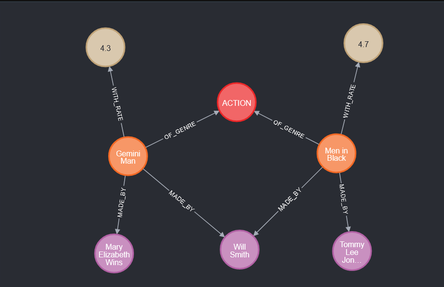

# EP_02 FILMS 

This project porpouse a function to recomend similar films based on filme that you like.


## About infra

In this solution, we have chosse a graph database to store infos about films, example: name, actor, rate, genre...

To make this project we use a neo4j to represent graph database and in this image below we are talk about the desing choosed.

## Graph database desing


## Run neo4j local

```bash
docker run --publish=7474:7474 --publish=7687:7687 --volume=$HOME/neo4j/data:/data neo4j
```

## Provider Infos

 - [Neo4j](https://neo4j.com/developer/get-started/)
 
## Authors

- [@Rafael Narbutis](https://github.com/rafaelnarbutis)
- [@Victor Moreno](https://github.com)
